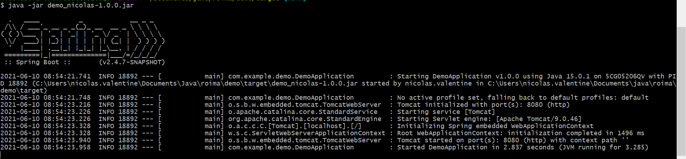

# Demo application for Roima intelligence
The application is a REST API with single `/transform` endpoint. This endpoint receives XML containing order infomation end returns order XML.

The application is build using Java, Spring-boot and maven.

## Table of contents
- [Demo application for Roima intelligence](#demo-application-for-roima-intelligence)
- [Run application](#run-application)
  - [JAR](#jar)
  - [Clone git repository](#clone-git-repository)
- [API](#api)
  - [POST /transform](#post-transform)
    - [HTTP responses](#http-responses)
- [Task information](#task-information)
- [Author](#author)

# Run application
## JAR
To run the application with JAR file follow these steps.
1. Navigate to folder where `demo_nicolas-1.0.0.jar` jar file is.
2. Run command `java -jar demo_nicolas-1.0.0.jar`
3. You should see something like this 

4. Confirm that the application is running on port `8080`. You should see a text *Tomcat started on port(s): 8080 (http) with context path* on the second last line of the comman line interface
5. Make a HTTP POST request to [localhost:8080/transform](localhost:8080/transform) with content type set to `application/xml`. Add [data.xml](./documents/data.xml) information to the request body

6. Server responses with HTTP 201 with response body containing the transformed information.

## Clone git repository
1. Run command `git clone https://github.com/veliValentine/roima-homework.git`
2. Install maven dependencies
3. Run Spring boot application

# API
Currently the API has one endpoint.

## POST /transform
[localhost:8080/transform](localhost:8080/transform)

Transforms `application/xml` type data into order xml.

Example of valid data.xml can be found [./documents/data.xml](./documents/data.xml)

### HTTP responses
- 201 when successfully transformed given xml to order xml
- 400 happens when given XML is invalid
  - Valid xml contains 
    - id
    - batch
    - at least one `<row>` element inside `<rows>` element
- 415 when made request contetn type differs from `application/xml` 

# Task information
Task:
 * Build REST API that consumes XML (src/main/resources/data.xml) 
    * Modify DemoController class by adding HTTP interface:
         * POST: /transform
         * Content-Type: application/xml
 * Modifies received XML message according to format below.
 * You will need Java and Maven to build and run the project.

This is what the service should respond (no comments needed):
     
     <order>
         <orderId>123_7</orderId> <!-- id + batch -->
         <documentDateTime>2021-05-31T11:59:15.932Z</documentDateTime> <!-- current datetime -->
         <orderRows>
            <orderRow>
                <rowNumber>1</rowNumber>
                <description>text1</description>
            </orderRow>
            <orderRow>
                <rowNumber>2</rowNumber>
                <description>text2</description>
            </orderRow>
            <orderRow>
                <rowNumber>3</rowNumber>
                <description>text3</description>
            </orderRow>
         </orderRows>
     </order>

* TIPS:
  * /src/main/resources/transform.xsl: blank for creating XSLT-transformer
  * DemoTransformer class can be used for transforming.
  * https://spring.io/guides/tutorials/rest/

# Author
[veliValentine](https://github.com/veliValentine)